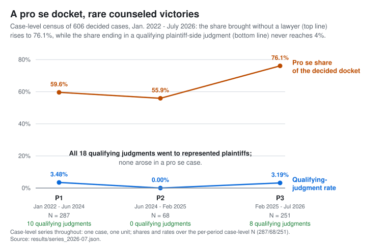

# The Argument

This is the legal argument of *Duty Without Data: Disability Fair Housing and the Record-Dependent
Right* (Arizona Law Review, forthcoming 2026), compressed to a fifteen-minute read for lawyers who
have not read it. Every proposition here is developed, with full citations, in the manuscript
([`../manuscript/Duty_Without_Data.md`](../manuscript/Duty_Without_Data.md)); the Part references below
point into it. It is orientation, not authority, and not legal advice (authorship and AI-use
disclosure: [`../AI_USE.md`](../AI_USE.md)).

Disability fair-housing rights are *record-dependent* — their ordinary proof turns on records of
the regulated party's own conduct — and the remedy here is a rulemaking petition asking HUD for
the minimum records that make existing duties verifiable.

## 1. The problem, in one case

In May 2010, the Mobile Housing Board issued Donavette Ely a four-bedroom Section 8 voucher because
her son's asthma was severe enough that his physician recommended a bedroom with separate temperature
controls; the Board's own written explanation cited his "present medical condition." Ely searched but
could not find an affordable four-bedroom unit in time. The Board granted one extension, denied more
time, and later removed the family from the program. The Eleventh Circuit affirmed judgment for the
Board: it "cannot be liable for refusing to grant a reasonable and necessary accommodation if the
[Board] never knew the accommodation was in fact necessary," because Ely "never explained to the
Board that she needed a voucher extension to compensate for her son's disability." *Ely v. Mobile
Hous. Bd.*, 605 F. App'x 846, 851–52 (11th Cir. 2015).

The disability-related basis of her request was sitting in the Board's own file. No record system
carried it forward to the moment of decision. The right was not absent; the record architecture was.
(Introduction.)

## 2. Record-dependent rights, and what enforcement shows

Disability fair-housing rights are *record-dependent*: ordinary proof of their operative elements —
notice, nexus, timing, denial, covered-building status, accessible-unit count, allocation — turns on
records of the regulated party's own conduct. Race-discrimination enforcement can often begin from
aggregate pattern data (segregation indices, lending statistics). Disability enforcement ordinarily
cannot: a reasonable-accommodation case asks whether a specific request received a specific response
in a specific timeframe; a design-and-construction case asks whether a specific building meets
specific standards; a Section 504 case asks whether a specific project clears an accessible-unit
floor. If no one is required to record those facts, the rights persist on paper and fail in proof.
(Part I lead and Part I.A.)

The resulting problem is the space between enacted, enforceable duties and the records needed to
verify them. That space is not empty — HUD's own instruments already touch these records — but it is
**fragmented**: created unevenly program by program, reviewed episodically, and never brought into
recurring cross-program view. Roughly
[1.80 million disabled households](appendices/Appendix_L_HUD_Administrative_Data.md) live in HUD-assisted housing,
and no coordinated federal system verifies the disability duties those programs carry.
(Introduction; Part I.)

<!-- claim-block: census-headline -->
The enforcement backdrop makes the gap concrete. In an original corpus of 1,900 screened federal
opinion and order records, a case-level census of every decided case found eighteen qualifying
plaintiff-side judgments — nine final contested judgments awarding relief, two final default
judgments, and seven liability determinations with the remedy unresolved — across four and a
half years: eighteen of 606 decided cases, or 3.0% (3.48% / 0.00% / 3.19% per period, none in
the short P2 window). In every one of the eighteen, counsel had appeared for the plaintiff by
the qualifying disposition; not one arose in a pro se case. Meanwhile the share of decided cases
brought without a lawyer rose from 59.6% to 76.1%.

<picture>
  <source media="(prefers-color-scheme: dark)" srcset="../results/figures/fig1_composition_dark.svg">
  
</picture>
<!-- /claim-block -->

The missing records show up in how unrepresented plaintiffs lose: among pleading-stage losses,
failure to translate a factual narrative into the legal elements courts screen for is more common
in pro se losses than in represented ones. The coding is machine-based, so the finding is
directional. Private enforcement does not substitute for administrative records; it depends on
them. (Part II.E.)

*The figure regenerates from the archive's canonical artifacts; sources, intervals, reproduction
commands, and the boundaries of the evidence:
[README](../README.md#check-do-not-just-trust) · [`../replication/REPRODUCE.md`](../replication/REPRODUCE.md) ·
[`EVIDENCE_AND_LIMITS.md`](EVIDENCE_AND_LIMITS.md).*

## 3. The authorities, and the work each does

None of this requires new legislation. (Part III.A.)

**42 U.S.C. § 3604(f)(3).** The 1988 Fair Housing Amendments Act disability package: reasonable
accommodations ((f)(3)(B)), reasonable modifications ((f)(3)(A)), and design-and-construction
standards for post-1991 covered multifamily housing ((f)(3)(C)). These are the substantive duties
the records would verify.

**Section 504 (29 U.S.C. § 794) and 24 C.F.R. Part 8 (§§ 8.22–8.27).** Accessible-unit floors in
HUD-assisted new construction and substantial alteration (5% mobility, 2% hearing-vision), plus
distribution (§ 8.26) and allocation (§ 8.27) duties — capacity and placement duties that
presuppose inventories and matching records.

**42 U.S.C. § 3614a.** Express authority to issue "rules for the collection, maintenance, and
analysis of appropriate data" — enacted in the same 1988 statute as the disability duties. The
data-rule anchor.

**42 U.S.C. § 3608(e)(6) and § 3608(f).** Annual reporting on "handicap" and family
characteristics, among enumerated categories, for persons served by HUD programs; § 3608(f)
enumerates § 504 among the civil-rights authorities whose coverage defines that reporting duty —
the statute's own tie between disability-data reporting and § 504.

**24 C.F.R. Part 121 (§ 121.2).** HUD's own 1989 regulation directing program participants to
furnish data concerning handicap and family characteristics as the Secretary determines necessary
or appropriate. On the books since 1989; the located record shows fragmentation rather than use
at scale.

**5 U.S.C. § 553(e).** "[E]ach agency shall give an interested person the right to petition for
the issuance, amendment, or repeal of a rule." HUD's petition procedure is 24 C.F.R. § 10.20. The
vehicle.

**The review standard.** *Massachusetts v. EPA*, 549 U.S. 497, 527–28 (2007): denial of a
rulemaking petition is judicially reviewable under the arbitrary-and-capricious standard. *Motor
Vehicle Mfrs. Ass'n v. State Farm*, 463 U.S. 29, 43 (1983): the denial must display a rational
connection between the record and the decision, and must not ignore an important aspect of the
problem.

***Loper Bright Enters. v. Raimondo*, 603 U.S. 369 (2024).** Posture, not obstacle. With *Chevron*
deference gone, the premium falls on rules tied to express statutory text — and a data rule under
§ 3614a's express data clause is that kind of rule. The Note does not treat codification as
self-executing durability: each requested module stands on express text rather than on any
contested general mandate. (Parts III.A, III.E.)

## 4. HUD's own administrative record

What turns the gap into an administrative-law claim is HUD's own paper trail. Each entry links to
a primary document; most are archived in this repository. (Part I.E.)

**1988.** Congress enacts § 3614a (express data-rule authority) and § 3608(e)(6) (handicap and
family-characteristics reporting) in the same statute as the disability duties.
([42 U.S.C. § 3614a](https://www.law.cornell.edu/uscode/text/42/3614a);
[42 U.S.C. § 3608](https://www.law.cornell.edu/uscode/text/42/3608).)

**1989.** HUD promulgates 24 C.F.R. Part 121. The preamble engages commenters' assertion that HUD
"has failed to generate such data" and responds that HUD "remains committed to that objective."
54 Fed. Reg. 3,232, 3,278–79 (Jan. 23, 1989).
(Archived: [`../record/hud-27061/54FR3232_part_121_promulgation.pdf`](../record/hud-27061/54FR3232_part_121_promulgation.pdf);
[`../record/hud-27061/54FR3278_part_121_preamble_data_response.pdf`](../record/hud-27061/54FR3278_part_121_preamble_data_response.pdf).)

**2022.** HUD proposes updating Form HUD-27061 "to collect protected class data as required by the
Fair Housing Act and HUD regulations at 24 CFR 121." 87 Fed. Reg. 58,524 (Sept. 27, 2022).
(Archived: [`../record/hud-27061/87FR58524_proposal.pdf`](../record/hud-27061/87FR58524_proposal.pdf).)

**2023.** The 30-day notice and the OMB approval narrow the collection to race and ethnicity,
re-grounded in Title VI, with no contemporaneous explanation in the located record of where the
proposed disability categories went. 88 Fed. Reg. 5,370 (Jan. 27, 2023).
(Archived: [`../record/hud-27061/88FR5370_30day_notice.pdf`](../record/hud-27061/88FR5370_30day_notice.pdf);
the approved form: [`../record/hud-27061/form_HUD-27061_current.pdf`](../record/hud-27061/form_HUD-27061_current.pdf).)

**2026.** HUD proposes renewing the narrowed form unchanged — still describing it as collecting
"race, ethnicity, and other protected class data" required by the Fair Housing Act — while the
approval reaches its June 30, 2026 expiration with no successor collection on record. 91 Fed.
Reg. 35,697 (June 12, 2026).
([Notice at federalregister.gov](https://www.federalregister.gov/citation/91-FR-35697); status
record: [`appendices/admin_record_c/pra_comment_2026/`](appendices/admin_record_c/pra_comment_2026/).)

Two record features do particular work in the reviewability analysis (Part I.E):

1. **The identical burden estimate.** HUD applied the same 8,625-hour annual burden estimate to both
   the broader 2022 proposal and the narrower 2023 collection. That does not show the broader
   collection costless — but the public record contains no burden rationale for the narrowing.
2. **Described broader than built.** The 2026 renewal notice still carries the 2022 title and still
   describes the form as gathering protected-class data required by the Fair Housing Act — a scope
   the instrument does not field.

The Note is deliberately careful about the expiration. It does not claim the collection "lapsed";
gaps between a form's expiration and its renewal approval may prove administratively routine. The
argument holds on either branch: a completed renewal would re-ratify the 2023 disability omission in
a fresh 2026 record, and an unrepaired expiration leaves enacted disability duties with no approved
cross-program collection at all. Neither branch supplies the missing architecture, and neither
displaces the petition. (Part I.E.)

### The summer-2026 landscape

Three 2026 federal actions reframed the field the Note writes into. On June 18, 2026, the Office
of Legal Counsel concluded that the HHS and DOJ integration
regulations exceed statutory authority. On July 20, 2026, DOJ declared its *Olmstead* enforcement
guidance "not enforceable." 91 Fed. Reg. 45,287 (July 20, 2026). And on July 23, 2026, the EEOC
proposed rescinding the EEO-1 through EEO-6 recurring demographic reports, 91 Fed. Reg. 46,332
— while expressly retaining the general record-preservation requirements whose text reaches
requests for reasonable accommodation, 29 C.F.R. §§ 1602.14, 1602.31, 1602.40. The Note's response
is the distinction its Part III.E names **records, not reports**: what the petition seeks are
transaction and asset records of regulated conduct, not recurring demographic reports, and none of
the 2026 actions addresses the statutory footing — § 3604(f)(3), § 3608(e)(6), § 3614a, § 504's
express rulemaking command — on which each requested module independently stands. The same
landscape supplies two of the objections answered in section 6. (Introduction; Part III.E; Part
IV.D.)

## 5. The remedy — and why its narrowness is the point

The vehicle is a petition under 5 U.S.C. § 553(e) asking HUD for a defined minimum-record rule —
an amendment to Part 8 and the applicable program regulations, or a stand-alone companion regulation
under § 3614a and Part 121 — grounded in § 3614a, § 3608(e)(6), § 3608(f), § 504, and Part 8. The
requested rule has four expressly severable objects: (1) transaction records of accommodation,
modification, and transfer requests, kept dual-source with a contemporaneous accessible copy to the
requester; (2) accessible-unit inventory and program-compliance asset records; (3) PRA-cleared
aggregate reporting under § 3608(e)(6) with small-cell suppression; and (4) a severable
regulator-only matching module under Privacy Act treatment. A ground for denying one module is not a
ground for denying another. The petition's *policy* object is the rule. Its *legal* object is
narrower: a reasoned agency decision. (Part IV.A.)

The petition places a defined administrative record before HUD. Section 555(b) requires
HUD to conclude the matter within a reasonable time; § 555(e) requires a statement of the grounds for
any denial. If HUD grants, HUD — not any court — designs the rule. If HUD denies, the denial is final
agency action under *Bennett v. Spear*, 520 U.S. 154, 177–78 (1997), and gets ordinary
arbitrary-and-capricious review under 5 U.S.C. § 706(2)(A). The remedy is remand for explanation —
not judicial design of a database, not a court-ordered field list. If HUD neither grants nor denies,
§ 555(b)'s reasonable-time duty supplies a narrower § 706(1) bridge to compel a response. (Parts
IV.A–IV.C.)

The limiting principle is **reinforcement, not replication**: make duties Congress already enacted
verifiable; derive no new obligations. Nothing in the argument rests on § 3608(e)(5)'s open-textured
planning language — the provision whose contested readings produced the AFFH rule's repeated
reversals. (Parts I, III.A, IV.)

And the argument is built for the deferential standard, not in spite of it. Petition-denial review
overturns denials only in "the rarest and most compelling of circumstances." *Am. Horse Prot. Ass'n
v. Lyng*, 812 F.2d 1, 4–5 (D.C. Cir. 1987). The petition is designed against that threshold: express
statutory data authority; HUD's own regulatory text and 1989 preamble commitment; the 2022–2026
record; § 504/Part 8 duties that presuppose the records sought; the census composition
findings; and a privacy-and-phasing design (HMDA-style tiered disclosure; no diagnoses or medical
narratives; no public tenant-unit matching) that pre-answers the strongest objection. Under *State
Farm*, a denial that does not engage those materials fails the requirement to consider the
important aspects of the problem. (Parts III.B, IV.A, IV.C.)

On who brings it: after *FDA v. Alliance for Hippocratic Medicine*, 602 U.S. 367 (2024), and
*Connecticut Fair Housing Center v. CoreLogic Rental Property Solutions, LLC*, 167 F.4th 605 (2d Cir.
2026), any eventual review case should be led by an individual with a concrete, ongoing
assisted-housing transaction — a voucher holder, waitlist applicant, or tenant with an open
accommodation, transfer, or extension request — with organizational layers reinforcing rather than
carrying the case. After *TransUnion LLC v. Ramirez*, 594 U.S. 413, 442 (2021), the injury is not the
absence of information in the abstract; it is the petitioner's concrete interest in the
accessible-unit, accommodation, and transfer functions on which her housing depends. (Part IV.B; the
extended analysis is
[`appendices/Appendix_D_Standing_Reviewability_Annex.md`](appendices/Appendix_D_Standing_Reviewability_Annex.md).)

## 6. Objections, answers, and where to go deeper

The Note collects HUD's best responses and answers them on the record. (Part IV.D.) Two are new to
the 2026 landscape: *if HUD invokes the June 2026 OLC opinion's evenhanded-treatment reasoning*, the
modules impose no substantive obligation and rest on authorities the opinion does not analyze; *if
HUD invokes the classification and burden concerns of the EEOC's rescission proposal*, that proposal
itself retains transaction-level record preservation while rescinding recurring reports — the
record/report line the petition is built on.

**"This is enforcement discretion" (Heckler v. Chaney).** The petition does not ask HUD to bring
enforcement actions; it asks HUD to decide whether to initiate rulemaking. *Chaney* does not bar
review of rulemaking-petition denials, and *Massachusetts v. EPA* confirms their reviewability.

**"Part 121 is fragmented and discretionary."** The "necessary or appropriate" qualifier preserves
Secretarial discretion — the Note concedes that. But discretion does not foreclose
reasoned-explanation review of a data category the agency itself invoked in 2022 and then dropped
without explanation in the located record. Part 121's fragmented, program-specific implementation is part of the problem
the petition puts to the agency, not a defense to answering it.

**"ADAPT v. HUD forecloses this."** *ADAPT v. HUD*, 170 F.3d 381 (3d Cir. 1999), rejected a
generalized effort to compel HUD disability enforcement. The Note distinguishes it on three grounds:
(1) this claim targets a discrete rulemaking petition, not generalized enforcement compulsion;
(2) ADAPT pressed § 3608(e)(6) and Part 121 only as law to apply against discretionary enforcement —
the *Chaney* axis — and § 3614a was never invoked; and (3) the 2022–2026 PRA record did not exist when
ADAPT was litigated.

**"Privacy, cost, and burden."** The proposed rule publishes aggregate compliance facts under
HMDA-style disclosure tiers, not medical records; the petition seeks a phased, assisted-housing
pilot; and HUD used the identical 8,625-hour burden estimate for both the broad and narrow scopes.
The strongest record-based version of this objection is HUD's own, recorded in GAO's 2023 audit
([`../record/hud-27061/GAO_23_105083.pdf`](../record/hud-27061/GAO_23_105083.pdf)): HUD's fair-housing office said
aggregate request data would be resource-intensive without meaningful impact, and HUD noted
owner-level collection could deter program participation. GAO answered on the same pages — aggregate
request and disposition data could signal noncompliance risk and target compliance activity, HUD's
own technical comments conceded the analytic use, and HUD's research office acknowledged that HUD
could make changes to its existing data systems. A denial that repeats the objection without engaging
GAO's answer perpetuates the engagement deficit rather than curing it.

**"Major questions, federalism, the PRA."** The rule falls on the ordinary-administration side of
every line: a HUD-funded perimeter only (for vouchers, obligations attach to PHA administration, not
to private landlords by virtue of accepting a voucher); categorical compliance facts, no diagnoses;
notice-and-comment rulemaking first, applied prospectively through future funding instruments; no new
private right of action, with existing FHA and § 504 remedies untouched; and § 3614a's express data
clause anchoring authority. The Paperwork Reduction Act's judicial-review bar, 44 U.S.C.
§ 3507(d)(6), insulates OMB's clearance decisions — not HUD's reasons for declining to initiate
rulemaking under its own statutes and regulations.

**What the Note concedes.** Section 3608(e)(6) is best read as person- or household-level authority;
building-level inventories rest on § 3614a and on § 504/Part 8 and program-contract authority.
Recordkeeping mandates are not automatically ministerial. And the empirical findings prove
composition, not causation: they show that private enforcement operates through records and that the
litigants least able to generate them increasingly populate the docket — not that any missing field
would have changed a particular case's outcome. (Parts II.F, III.A.)

**Where to go deeper.** Five minutes: the
[archive front door](../README.md#what-the-archive-shows). Thirty: the manuscript's
[Introduction and Part IV](../manuscript/Duty_Without_Data.md). Evaluating the vehicle: manuscript
Parts II–III, the
[standing and reviewability annex](appendices/Appendix_D_Standing_Reviewability_Annex.md), then the
[implementation materials](../action/TAKE_ACTION.md). The administrative record in full:
[Appendix C](appendices/Appendix_C_HUD_Administrative_Record.md), with the petition's
twelve-exhibit evidentiary map at § C.5. The research method and its limits:
[`../method/METHODOLOGY.md`](../method/METHODOLOGY.md) and
[`EVIDENCE_AND_LIMITS.md`](EVIDENCE_AND_LIMITS.md).
