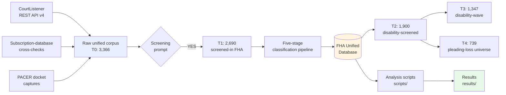
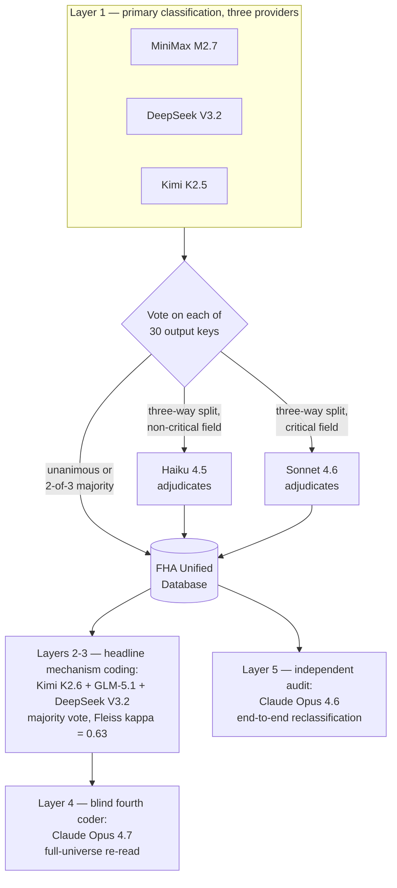

# Model-Assisted Classification Method — Technical Companion

The technical companion to the [README](../README.md)'s plain-English summary: the full methodology design, the classification pipeline, the validation layers, the software inventory, the Note's three claim postures, and the exact headline statistics with their corpus tiers. Deeper still: [`VALIDATION.md`](VALIDATION.md) for the complete audit design and limitations, [`../replication/SAMPLE_DEFINITIONS.md`](../replication/SAMPLE_DEFINITIONS.md) for exact tier filters, and [`../replication/REPRODUCE.md`](../replication/REPRODUCE.md) for regeneration commands.

---

## The method

The archive documents the model-assisted classification method used in the empirical analysis. Empirical legal studies has a scale problem: the standard approach — research assistants hand-coding opinions — runs to hundreds of coder-hours, tops out around a few hundred cases in practice, and rests its reliability on one or two human coders. That constraint is why this project includes no corpus-scale human-coded benchmark.

**The method** treats corpus classification as an engineering problem instead of a staffing problem: version-controlled prompts and vocabularies, separately run classifiers from different providers, tiered adjudication, automated regression checks on a registered set of published numbers, and re-runs cheap enough that the corpus is never frozen by sunk cost. The design choices:

- **Independent models, not one oracle.** Three separately run base models from different providers (MiniMax M2.7, DeepSeek V3.2, Kimi K2.5) classify every opinion separately, so agreement means something — it is unlikely to be an artifact of any single model's idiosyncrasies, though provider diversity does not establish that errors are independent.
- **Tiered adjudication under prespecified rules.** Unanimous answers and 2-of-3 majorities are adopted directly, with no adjudicator. Only a three-way split escalates, and it escalates by stakes: Haiku 4.5 resolves three-way splits on non-critical fields; Sonnet 4.6 resolves three-way splits on critical fields (outcome, primary claim type, claim types). Either adjudicator receives the case text and each model's answer for the disputed fields. Cheap where stakes are low, stronger where they are high. Who filled those adjudicator roles differs by run: the RA Database component used Haiku 4.5 and Sonnet 4.6, while the merged 2015 FHA Database component used a MiniMax tiebreaker — the same model family as one of the three base classifiers — for 742 of its 1,496 records. The per-run tier counts are in [`pipeline/adjudication_metadata.json`](pipeline/adjudication_metadata.json).
- **Structured classification, not legal reasoning.** The models map opinion text onto pre-specified controlled vocabularies — 30 output keys per case covering outcome, parties, claim types, procedural stage, and more — by answering fixed questions. They do not make legal conclusions or independently establish the facts of a case. Every prompt and vocabulary is committed in [`prompts/`](prompts/) and [`pipeline/`](pipeline/). (Where pipeline documents name the Stage 4 operation "per-claim structured extraction," that is the term of art for parsing structured claim records out of opinion text; it asserts no fact about any case. Outside that stage name and the filenames that implement it, this archive describes model behavior as classification.)
- **The headline number gets its own ensemble.** The pro se / represented mechanism finding is coded by a separate three-model majority vote (Kimi K2.6 + GLM-5.1 + DeepSeek V3.2, Fleiss' κ = 0.63) — then audited by a *different vendor's* models: a blind Claude Opus 4.7 re-read of all 668 coded cases and an end-to-end Opus 4.6 reclassification audit. The classifiers and their auditors do not share a lab.
- **Regression tests for a law-review article.** [`../article/CLAIMS_LEDGER.csv`](../article/CLAIMS_LEDGER.csv) maps the Note's printed and directly relied-on claims — 53 rows — to their source and evidence route; [`../scripts/validate_claims.py`](../scripts/validate_claims.py) recomputes 41 registered assertions from the frozen canonical database and flags any drift beyond rounding tolerance; [`../scripts/check_claims_ledger.py`](../scripts/check_claims_ledger.py) verifies the ledger's structure and that every evidence route resolves. Stated exactly, because the difference matters: the 41 assertions are a registered selection, not every number in the article, and 12 of the 53 rows rest on the cited primary source plus privately retained material rather than on a claim-specific public artifact. What the ledger gates is that no printed claim lacks a recorded source and route — not that a script recomputes every sentence.
- **Cheap enough to redo.** The primary three-classifier run — 2,522 opinions in the original build (2,690 after the July 2026 refresh), 30 output keys each — cost $85.59 in model-API spend, and the full pipeline (screening, per-claim extraction, the audits, and one abandoned candidate-model run) came to roughly $160, with the Haiku and Sonnet adjudication calls billed separately and not itemized. When reclassifying the entire universe costs less than a casebook, the schema can improve iteratively, and the full corpus was in fact re-coded from scratch multiple times purely to test reproducibility.

The pipeline, end to end:

*Text equivalent of the diagram: three sources -- the CourtListener REST API v4,
subscription-database cross-checks, and PACER docket captures -- feed a raw unified corpus
(T0: 3,366). A screening prompt passes records marked YES through to T1: 2,690 screened-in
FHA. T1 enters a five-stage classification pipeline, which produces the FHA Unified
Database. From the database comes T2: 1,900 disability-screened, and from T2 come both
T3: 1,347 disability-wave and T4: 739 pleading-loss universe. The database also feeds the
analysis scripts in `scripts/`, which write to `results/`.*

One pipeline stage sits outside the validation layers below: screening. The screening pass is a
single model — Google Gemini 3.1 Flash Lite at temperature 0.0, answering a binary YES/NO
relevance question under the committed prompt ([`prompts/fha_screening_prompt.txt`](prompts/fha_screening_prompt.txt);
configuration in [`pipeline/model_configuration.md`](pipeline/model_configuration.md)) — and records
screened out do not enter T1 or any validation layer, so screening false negatives are unmeasured.
The screened-out records remain in the committed database with their screening labels, so the stage
can be audited by any reader, and re-run once the opinion texts are re-obtained (source identifiers
and hashes are preserved — [`../replication/DATA_PROVENANCE.md`](../replication/DATA_PROVENANCE.md)).

### Validation: five layers, nine models

| Layer | Design | Raw outputs published? | Result |
|---|---|---|---|
| 1 — Primary pipeline | MiniMax M2.7 + DeepSeek V3.2 + Kimi K2.5, tiered Haiku 4.5 / Sonnet 4.6 adjudication | Adjudication-tier metadata ([`pipeline/adjudication_metadata.json`](pipeline/adjudication_metadata.json)) in place of per-model raws | Produces `data/FHA_Unified_Database.json` |
| 2 — Three-model ensemble | Kimi K2.6 + GLM-5.1 + DeepSeek V3.2 majority vote; 668 of 676 pleading-loss cases as-run, 728 of 739 in the merged July 2026 corpus | For the as-run 676-row coding, yes — three per-model JSONs in [`validation_three_model/`](validation_three_model/); the July 2026 extension's per-case raw input is not redistributed ([`validation_three_model/build_merged_summary.py`](validation_three_model/build_merged_summary.py)), so the merged 728-row result is published as [`mechanism_merged_summary.json`](validation_three_model/mechanism_merged_summary.json), not as raws | Fleiss' κ = 0.6292 as-run / 0.6297 merged — just above the floor of the Landis & Koch 0.61–0.80 "substantial" band; primary source of the 45.3% / 13.7% ensemble figures (directional) |
| 3 — Single-model re-read | Kimi K2.6, stratified 150-case sample | Yes — [`validation_kimi_k2_6/`](validation_kimi_k2_6/) | Cohen's κ = 0.6264 |
| 4 — Blind fourth coder | Claude Opus 4.7 full-universe re-read, 668 cases via 22 parallel subagents | Yes — 22 seat outputs in [`validation_four_coder_full/`](validation_four_coder_full/) | κ = 0.60 vs. the ensemble; κ = 0.80 when Opus 4.7 instead directly adjudicates the 244 non-unanimous ensemble cases (sensitivity; unanimous ensemble labels are retained, so 424 of 668 agree by construction) |
| 5 — Independent audit | Claude Opus 4.6 end-to-end reclassification, stratified 50-opinion sample | Per-field metrics and error anatomy in [`../article/appendices/Appendix_A4_Reproducibility_Audit.md`](../article/appendices/Appendix_A4_Reproducibility_Audit.md); no per-opinion raws | 81.5% exact match across the full 12-field schema; κ = 0.561 on outcome — the lowest headline agreement statistic of the five layers (full end-to-end re-run, the archive's most demanding design) |

Vendor overlap, stated plainly: Layer 2 shares DeepSeek V3.2 with Layer 1, and Kimi K2.6 (Layers
2–3) comes from the same lab as Kimi K2.5 (Layer 1), so cross-layer agreement is not fully
independent evidence; the merged 2015-component tiebreaker (MiniMax) shares a model family with a
Layer 1 classifier — for those 742 of 1,496 records the tiebreaker was not independent of the
panel it was resolving ([`METHOD_SPECIFICATION.md`](METHOD_SPECIFICATION.md) § 5); the Layer 4–5
auditors share no lab with any classifier, though they do share one with the Layer 1 adjudicators
— Haiku 4.5, Sonnet 4.6, and the Opus auditors are all Anthropic models.

Who checks whom — classifiers, adjudicators, and their cross-vendor auditors:

*Text equivalent of the diagram: Layer 1 is primary classification by three independent
labs -- MiniMax M2.7, DeepSeek V3.2, and Kimi K2.5 -- which vote on each of 30 output keys.
Unanimous answers and 2-of-3 majorities enter the FHA Unified Database directly; three-way
splits on non-critical fields go to Haiku 4.5, and three-way splits on critical fields go
to Sonnet 4.6, each adjudicator receiving the case text and every model's answer, and both
writing back to the database. The database feeds Layers 2-3, the headline mechanism coding
(Kimi K2.6 + GLM-5.1 + DeepSeek V3.2, majority vote, Fleiss kappa = 0.63), which in turn
feeds Layer 4, a blind fourth-coder full-universe re-read by Claude Opus 4.7. The database
separately feeds Layer 5, an independent end-to-end reclassification audit by Claude Opus
4.6.*

> [!NOTE]
> All five layers establish **reproducibility**, not accuracy against a human-coded gold standard — no human-coded corpus of federal FHA disability opinions exists at this scale to benchmark against, which is precisely the scale problem the methodology addresses. The archive reports inter-model agreement, publishes the raw per-model outputs for the validation and mechanism-ensemble passes (the primary pipeline publishes adjudication-tier metadata in their place — the exact boundary is stated in [`SYSTEM_MAP.md`](SYSTEM_MAP.md)), and identifies which claims depend least on classification. Full design, metrics, and limitations: [`VALIDATION.md`](VALIDATION.md).

The honest trade: this design swaps human-coder drift for model-classification uncertainty, then measures that uncertainty from several independent directions. The method is complementary to traditional hand-coding, not a replacement for it — for small corpora, human coding may well be preferable. The contribution is demonstrating feasibility, transparency, and audit discipline at a scale hand-coding cannot reach on a student budget.

---

## The engineering

For readers evaluating the software rather than the law, what is actually in here:

- **Corpus construction.** Harvest against the CourtListener REST API v4, PACER docket captures, and subscription-database cross-checks; overnight multi-model classification drivers ([`../scripts/unified_overnight_openrouter.py`](../scripts/unified_overnight_openrouter.py)); merge and consensus resolution into a single unified JSON database ([`../scripts/build_unified_db.py`](../scripts/build_unified_db.py)). The as-run Java harvest and classification clients are retained in the project's private research records (non-buildable inspection copies); the committed query specifications at [`../replication/queries/courtlistener_api.md`](../replication/queries/courtlistener_api.md) document the retrieval.
- **Statistics** (Python: pandas / NumPy / SciPy / statsmodels). Kitagawa / Oaxaca-Blinder decomposition, chi-square tests with Cramér's V, 10,000-resample bootstrap confidence intervals under a fixed seed, regression analysis, and Census PUMS estimates with replicate-weight standard errors.
- **Government-data replication.** Census Bureau ACS PUMS analysis straight from the public API — no key required ([`../scripts/census_pums_replication.py`](../scripts/census_pums_replication.py)) — plus HUD administrative datasets and a full PRA / reginfo.gov evidentiary harvest ([`../record/hud-27061/`](../record/hud-27061/)).
- **Reproducibility infrastructure.** Central path config with no hardcoded absolute paths ([`../scripts/config.py`](../scripts/config.py)), per-claim regeneration commands ([`../replication/REPRODUCE.md`](../replication/REPRODUCE.md) — core analyses are scripted individually; `scripts/run_all.py` covers the core set, while the comparator, registered-baseline, and QAP modules have their own commands), claim-level regression checks ([`../scripts/validate_claims.py`](../scripts/validate_claims.py)), a release-tree hash manifest ([`../scripts/check_release_manifest.py`](../scripts/check_release_manifest.py)), and path-leak / internal-link guards run before release ([`../scripts/check_no_user_paths.py`](../scripts/check_no_user_paths.py), [`../scripts/check_internal_links.py`](../scripts/check_internal_links.py)).
- **Documentation discipline.** A field-level data dictionary, canonical sample definitions, data provenance with retrieval dates, and two crosswalks mapping every section and appendix citation in the Note to the exact repository file behind it.

---

## Running this method on your own question

Nothing above is specific to fair housing. The same design applies to any legal-research question of
the form "across a large corpus of documents, how often does X happen, and under what conditions" —
outcomes by claim type, procedural postures, remedial patterns, agency-decision features. This
project is one worked example; the steps below are the transferable method, with pointers to the
reusable pieces in this repository.

1. **Fix the questions before touching a model.** Write every field as a controlled vocabulary with
   enumerated values, the way this project committed its 30 output keys in [`prompts/`](prompts/) and
   [`pipeline/`](pipeline/). If two lawyers could disagree about what a field means, the models will
   too — the vocabulary is where that ambiguity gets settled, in writing, before classification
   starts. Keep the models on classification: any field that requires *deciding* a legal question rather
   than locating what the court said belongs in your analysis layer, not your classification layer.
2. **Assemble the corpus from a queryable public source, then screen cheaply.** This project pulled
   from the CourtListener REST API (queries committed in [`../replication/queries/`](../replication/queries/)) and ran an
   inexpensive screening prompt before the expensive pipeline — 3,366 raw records in, 2,690
   screened-in. Screening is where most of the cost savings live.
3. **Classify with separately run models — plural.** At least three, from different
   providers, answering the same prompt about every document. Agreement across providers is evidence;
   agreement within one model family may be a shared training quirk. Then route disagreements by
   stakes under prespecified adjudication rules: unanimous answers and 2-of-3 majorities are adopted directly, and only a
   three-way split escalates -- to a cheaper designated adjudicator on non-critical fields, to a
   stronger one on outcome-critical fields. The overnight driver
   ([`../scripts/unified_overnight_openrouter.py`](../scripts/unified_overnight_openrouter.py)) and merge
   step ([`../scripts/build_unified_db.py`](../scripts/build_unified_db.py)) show one working
   implementation.
4. **Give your headline finding its own, separate coding.** Whatever number the paper will lead
   with deserves a dedicated ensemble of models that did not build the database, a majority-vote
   rule, and a reported agreement statistic — here, a three-model vote at Fleiss' κ = 0.63. Then
   have a *different vendor's* model audit it blind. Classifiers and auditors should not share a
   lab.
5. **Publish the disagreement, not just the agreement.** Raw per-model outputs, adjudication logs,
   and the kappas — committed, not summarized. The credibility of an LLM-coded dataset comes from
   the audit trail, not from the headline agreement number. The three
   [`validation_*/`](validation_three_model/) directories are the pattern. In this archive that
   standard is met by the validation passes and the as-run mechanism-ensemble coding, with two
   exceptions: the primary database pipeline publishes its adjudication tier metadata in place of
   per-model raw outputs, and the July 2026 mechanism-extension per-case raw coding input is not
   redistributed — the exact boundary is stated in [`SYSTEM_MAP.md`](SYSTEM_MAP.md).
6. **Build the regression test before writing the article.** A claims ledger mapping the
   printed and directly relied-on claims to their source and evidence route
   ([`../article/CLAIMS_LEDGER.csv`](../article/CLAIMS_LEDGER.csv)), plus a script that recomputes a registered set of
   published numbers from the raw database and fails loudly on drift
   ([`../scripts/validate_claims.py`](../scripts/validate_claims.py)), plus a gate that holds the ledger itself to
   its shape and keeps every evidence route resolving
   ([`../scripts/check_claims_ledger.py`](../scripts/check_claims_ledger.py)). The rule it enforces: cite nothing
   you cannot route to a source — and, for the registered set, nothing you cannot recompute.
7. **Say what the validation does and does not establish.** Multi-model reproducibility is not
   accuracy against human coding, and readers should not have to discover that limitation
   themselves. Label which claims depend on classification and which rest on directly observed
   public records (the three-posture scheme below); report the limitation prominently
   ([`VALIDATION.md`](VALIDATION.md)).

The feasibility point is the budget: the primary three-classifier run — 2,690 opinions, 30 output
keys — cost $85.59 in API spend, inside a full pipeline totalling roughly $160 (adjudication calls
billed separately, not itemized), cheap enough that this corpus was
re-coded from scratch multiple times purely to test reproducibility. The scale that once required a
funded team and a semester of coder-hours is now a design problem one researcher can carry, provided
the discipline above travels with it.

---

## Three kinds of claims, three kinds of support

The Note cites empirical material in three postures. The ledger makes each posture explicit.

- **Directly observed administrative-record claims.** The 2022–2023 Form HUD-27061 PRA cycle, the identical 8,625-hour burden estimate, HUD's 2023 Title VI / 24 C.F.R. Part 1 framing, the 1989 Part 121 preamble, and the 2023 NSPIRE final-rule concession that NSPIRE compliance does not establish § 504 accessibility compliance. These rest on the Federal Register, reginfo.gov, and HUD's published rule text. The archive preserves the queries, retrieval dates, and text excerpts.
- **Audit-replicable crosswalk claims.** The 17-category NSPIRE / UFAS crosswalk, the Part 8 stock-level verification-gap derivation, the 51-jurisdiction LIHTC QAP accessibility audit, the 47-AFH disability-depth audit, the FY 1989 – FY 2023 HUD annual-report longitudinal audit, the HMDA disclosure-effect meta-analysis, and the Australia SDA comparative note. Each is documented by a human-authored memorandum keyed to a retrievable public source.
- **Classification-dependent stakes claims.** Stakes evidence drawn from the litigation database described above, including the 739-case pleading-loss universe and the TRANSLATION-family split — ensemble figures 45.3% pro se / 13.7% represented, directional only — (primary coding by the three-model majority-vote ensemble on 728 of the 739-row universe — 738 rows entered coding, one residual row did not, and ten were dropped where at least one coder returned unparseable output; row-by-row accounting in [`../replication/SAMPLE_DEFINITIONS.md`](../replication/SAMPLE_DEFINITIONS.md) § 2 and [`VALIDATION.md`](VALIDATION.md) § 3). The Note cites these as *stakes evidence*, not as the administrative-record predicate for the APA claim.

---

## Headline numbers cited in the Note

Every number below is computed on `data/FHA_Unified_Database.json` and reproduces from the scripts in `scripts/`. The README presents the same stakes evidence graphically as Figures 1 and 2.

<strong>Administrative-record (non-classification) claims</strong> — not derived from the litigation database

- Form HUD-27061 2022 60-day notice invoked "protected class data as required by the Fair Housing Act and HUD regulations at 24 CFR 121"; 2023 30-day notice and final ICR adopted a "Race and Ethnic Collection" grounded in Title VI and 24 C.F.R. Part 1, with an identical 8,625-hour annual respondent-burden estimate.
- Across 17 consolidated UFAS / § 504 accessibility categories, NSPIRE inspects zero in full, four partially, and thirteen not at all; no NSPIRE item counts accessible units.
- Part 8 illustrative benchmark: 117,349 units derived by applying § 8.22(b)'s 5% mobility floor to the 2,346,974-unit federally-assisted project-based pool.

<strong>Stakes-evidence (classification-dependent) claims</strong> — derived from <code>data/FHA_Unified_Database.json</code>

- 3,366 raw federal FHA records; 2,690 screened-in FHA opinions; **1,900** disability-screened opinions (T2); **995 dated-decided** (P1 = 476, P2 = 120, P3 = 399). T2-narrow yields 1,849 / 972.
- P3 is a finite database period: February 5, 2025 through the database endpoint, July 1, 2026.
- **Two levels of counting.** The scripted tables in `results/` count opinion **documents**; the Note's reported Part II outcome figures count **cases**, built from a full case-level census of the 995-row decided universe under the universal one-case-one-unit rule (multiple decided documents from the same case collapse to a single case-level unit). The census was adjudicated case by case by the author, with final inclusion and finality determinations ([`../AI_USE.md`](../AI_USE.md)); the collapse from the published per-row record to the registered series is deterministic and gate-checked ([`../replication/CASE_LEVEL_RULES.md`](../replication/CASE_LEVEL_RULES.md)). The case-level series is the series of record.
- Case-level series ([`../results/series_2026-07.json`](../results/series_2026-07.json)): decided N = 287 / 68 / 251 (pooled **606**); **eighteen qualifying plaintiff-side judgments** (10 / 0 / 8; nine final contested, two final defaults, seven liability-only with remedy unresolved), a qualifying-judgment rate of **3.48% / 0.00% / 3.19%** (broad favorable 4.18 / 0.00 / 3.59); **zero pro se qualifying judgments** in any period (0 of 400 pooled; represented 18 of 206, 8.7%); case-level pro se docket share **59.6% / 55.9% / 76.1%**.
- 739-case pleading-loss universe; 728 cases received three-model ensemble mechanism coding (Kimi K2.6 + GLM-5.1 + DeepSeek V3.2 majority vote). Pro se TRANSLATION-family failures = **45.3%** (286/632); represented TRANSLATION-family failures = **13.7%** (13/95); pro se / represented gap = **31.6 percentage points** (χ²(1) = 32.70, p = 1.1 × 10⁻⁸; 95% CI [23.6, 39.5]). Fleiss' κ across the three coders = 0.6297 — just above the floor of the Landis & Koch 0.61–0.80 "substantial" band. Representation contingencies report 727 rows — 632 pro se, 95 represented — because one coded case (source-file ID 11267607 in the committed per-model results) carries an unknown representation status; the row-by-row accounting (739 rows; 738 entered coding; 728 coded; 727 in representation contingencies) is in [`../replication/SAMPLE_DEFINITIONS.md`](../replication/SAMPLE_DEFINITIONS.md) § 2 and [`VALIDATION.md`](VALIDATION.md) § 3.2. The χ² and confidence interval quantify sampling error only, not classification uncertainty; the blind fourth-coder replay of the pre-refresh 668-case universe — run under the same frozen prompt, so it bounds coder variance, not instrument effects ([`VALIDATION.md`](VALIDATION.md) § 3.5) — reproduces the gap at 29.2 pp with a 20.8 pp lower 95% bound ([`VALIDATION.md`](VALIDATION.md) §§ 5.3–5.4). The finding is directional and machine-based.

### Canonical corpus tiers

All classification-dependent claims nest inside reproducible tiers on `data/FHA_Unified_Database.json`. The authoritative table, including exact filter expressions, is in [`../replication/SAMPLE_DEFINITIONS.md`](../replication/SAMPLE_DEFINITIONS.md).

| Tier | Filter (paraphrase) | n |
|---|---|---|
| T0 — Raw unified corpus | all records | 3,366 |
| T1 — FHA screened-in | `screening_result != "NO"` AND `case_name` present (equivalent to `== "YES"` on this snapshot) | 2,690 |
| T2 — Disability-screened | T1 AND (`disability` ∈ `protected_classes` OR `disability_alleged` OR `is_ra_case`) | 1,900 |
| T2-narrow — Robustness sample | T1 AND `"disability" ∈ protected_classes` | 1,849 |
| T3 — Disability-wave tranche | T2 AND `date_filed ≥ 2022-01-01` | 1,347 |
| T4 — Pleading-loss universe | T2 AND pleading-stage loss filter | 739 |

T2's disjunctive filter is canonical for the Note because it mirrors the Note's doctrinal reasons for counting a disability allegation. T2-narrow is reported alongside T2 wherever the win-rate level is sensitive to filter choice; period-level findings reproduce directionally under both filters. Dated-decided within T2: **n = 995** (P1 = 476, P2 = 120, P3 = 399); T2-narrow dated-decided is n = 972.
