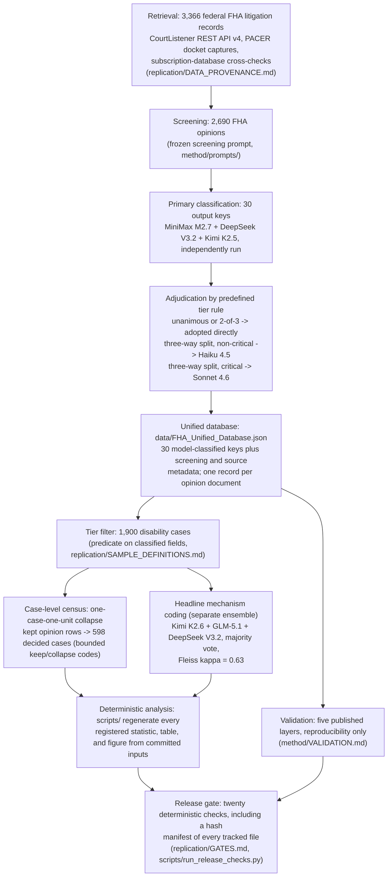

# System Map

One page: what this system is, where each stage's instruments and artifacts live,
and where the boundaries sit -- deterministic versus model-run, public versus not.
The method specification is [`METHOD_SPECIFICATION.md`](METHOD_SPECIFICATION.md); this file is the wiring
diagram.

## The system in one diagram

Text equivalent: retrieved records are screened by a frozen prompt to 2,690 FHA
opinions, then classified across 30 output keys by three independently run models,
with three-way splits adjudicated by a predefined routing rule (unanimous and 2-of-3
answers are adopted directly), producing the unified database. The 1,900-case
disability tier is not a screening output but a downstream filter applied to the
classified database. From that tier, two separate tracks produce the published
findings: a distinct three-model ensemble codes the headline pleading-failure
mechanism, and a documented one-case-one-unit collapse of the kept opinion rows
produces the 598-case outcome census.
Deterministic scripts regenerate
every registered statistic from those inputs. Five validation layers re-read the
classifications and report agreement. A twenty-check release gate re-verifies the
whole chain on every change.

## Stage-by-stage: instruments, artifacts, failure paths

| Stage | Instrument (public) | Output artifact (public) | On failure |
|---|---|---|---|
| Retrieval | retrieval spec, `replication/DATA_PROVENANCE.md` | source manifest `opinion_sources.csv` | miss recorded as unavailable, never backfilled silently |
| Screening | frozen prompt, `method/prompts/fha_screening_prompt.txt` | tier populations per `replication/SAMPLE_DEFINITIONS.md` (executable predicates) | unreadable text recorded, row retained with screening flag |
| Primary classification | frozen prompts, `method/prompts/`; model roster, `method/METHODOLOGY.md` | resolved labels in the database (per-model raw outputs are not part of this release) | failed batches resume from logged state |
| Adjudication | published tier rule, `method/pipeline/consensus_resolution.md` (machine-readable: `method/pipeline/adjudication_metadata.json`) | adjudicated labels + per-run tier distributions in the metadata (no per-case disagreement log for this stage) | routing rule is frozen; no mid-run changes |
| Mechanism ensemble | separate frozen instrument, `method/validation_kimi_k2_6/mechanism_prompt.txt`; protocol in Appendix M | mechanism labels + agreement statistics, `method/validation_three_model/` | disagreements logged; majority rule published |
| Case-level census | one-case-one-unit rule + bounded keep/collapse codes, `replication/CASE_LEVEL_RULES.md` | per-row record `replication/case_level_census.csv`; case-level series `results/series_2026-07.json` | emit gated on exact reproduction of the registered series |
| Deterministic analysis | `scripts/` (pinned dependencies) | tables, figures, registered values | any drift fails the release gate |
| Validation | layer designs, `method/VALIDATION.md` | agreement reports, `method/validation_*/` | reported as measured; no reruns-until-clean |
| Release gate | `replication/GATES.md` | check outputs + `RELEASE_MANIFEST.json` | red gate blocks release; checks are all-run, no short-circuit |

## The two model pipelines are not the same pipeline

The 30-key database is built by MiniMax M2.7, DeepSeek V3.2, and Kimi K2.5 with
designated adjudicators (Haiku 4.5, Sonnet 4.6 in the RA Database component; a
MiniMax tiebreaker in the merged 2015 FHA Database component -- see
[`METHOD_SPECIFICATION.md`](METHOD_SPECIFICATION.md) section 5). The headline mechanism finding is
coded by a separate ensemble -- Kimi K2.6, GLM-5.1, DeepSeek V3.2 -- under its own
instrument. Only DeepSeek V3.2 appears in both. Validation adds further models that
played no role in production, including an end-to-end reclassification audit by
Opus 4.6.

## Deterministic vs. model-run

Deterministic: population filters, the case-level collapse, and every registered
count and rate regenerate byte-stably from committed code and inputs; figures
regenerate from the committed scripts (byte-stability of the rendered figures is not
asserted). Model-run (bounded, not byte-replayable): the classification and
validation passes -- frozen instruments and published resolution rules make them
reproducible as fresh classifications under the same instruments, not as
byte-identical reruns.

## Public / non-public boundary

Public: the unified database, all frozen instruments, the mechanism ensemble's as-run raw
per-model outputs and disagreement log, the primary pipeline's tier metadata,
validation reports, the case-level census record, every script,
and the administrative record (`record/hud-27061/`). Not mirrored here: the primary
pipeline's per-model raw outputs, the July 2026 mechanism-extension per-case raw coding input
(its merged result is published as `mechanism_merged_summary.json`), large public
datasets and externally hosted public PDFs that the archive links rather than copies,
and opinion text whose redistribution is limited by its source; for each,
`replication/DATA_PROVENANCE.md` gives the source URL, the retrieval date, and the
reason it is not redistributed, and `LICENSING.md` states the terms. The boundary is
stated where it binds; nothing published depends on a non-public input beyond what
those files disclose.

## Where to verify a claim

Start at [`../article/CLAIMS_LEDGER.csv`](../article/CLAIMS_LEDGER.csv) for any
printed number, [`../article/FOOTNOTE_INDEX.md`](../article/FOOTNOTE_INDEX.md) for
any footnote, and [`../replication/VERIFY_ONE_CLAIM.md`](../replication/VERIFY_ONE_CLAIM.md)
for a worked ten-minute walkthrough from claim to artifact to gate.
