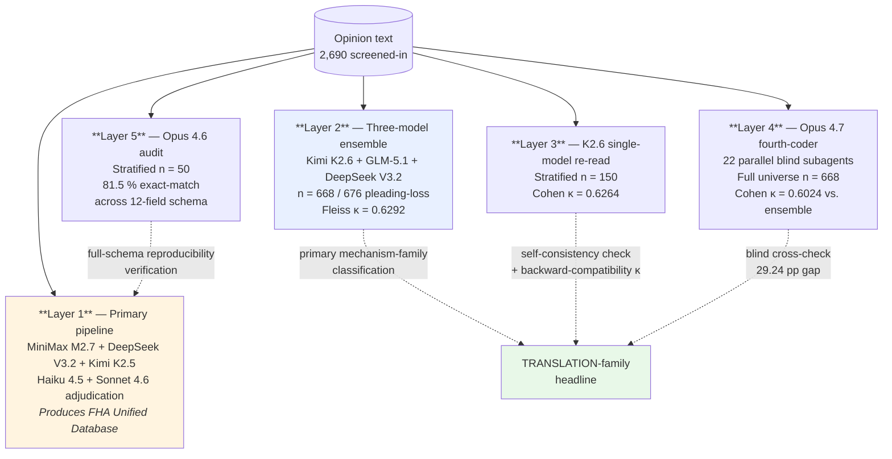

# Validation

This document consolidates the five validation layers that underlie the empirical claims in the Note. Each layer is described in full, with artifacts, metrics, and the interpretation the archive authorizes. The reader can reproduce every headline number by running the scripts listed under each layer.

**Contents.** [§ 1 What the archive does and does not claim](#1-what-the-archive-claims--and-does-not-claim) · [§ 2 Layer 1 — multi-model consensus pipeline](#2-layer-1--multi-model-consensus-pipeline-primary-classification) · [§ 3 Layer 2 — three-model majority-vote ensemble](#3-three-model-majority-vote-ensemble--primary-mechanism-family-classification-668-of-676-pleading-loss-cases) · [§ 4 Layer 3 — Kimi K2.6 single-model re-read](#4-layer-3--kimi-k26-independent-single-model-re-read-stratified-150-case-sample) · [§ 5 Layer 4 — fourth-coder blind re-read](#5-layer-4--four-coder-blind-full-universe-re-read-668-cases) · [§ 6 Layer 5 — Opus 4.6 50-opinion audit](#6-layer-5--opus-46-stratified-50-opinion-independent-classification-audit-reproducibility-audit) · [§ 7 Which claims depend on which layer](#7-which-claims-depend-on-which-validation-layer) · [§ 8 What validation does not prove](#8-what-the-validation-does-not-prove) · [§ 9 Replicating every number](#9-replicating-every-number-in-this-document)



*Text equivalent of the diagram: the opinion text (2,690 screened-in) feeds all five
layers. Layer 1 is the primary pipeline -- MiniMax M2.7 + DeepSeek V3.2 + Kimi K2.5 with
Haiku 4.5 and Sonnet 4.6 adjudication -- and produces the FHA Unified Database. Layer 2 is
the three-model ensemble (Kimi K2.6 + GLM-5.1 + DeepSeek V3.2, n = 668 / 676 pleading-loss,
Fleiss kappa = 0.6292). Layer 3 is the K2.6 single-model re-read (stratified n = 150,
Cohen kappa = 0.6264). Layer 4 is the Opus 4.7 fourth coder (22 parallel blind subagents,
full universe n = 668, Cohen kappa = 0.6024 against the ensemble). Layer 5 is the Opus 4.6
audit (stratified n = 50, 81.5 % exact-match across the 12-field schema). Layer 2 supplies
the primary mechanism-family classification behind the TRANSLATION-family headline; Layer 3
contributes a self-consistency check plus a backward-compatibility kappa to that headline;
Layer 4 contributes a blind cross-check with a 29.24 percentage-point gap; and Layer 5
feeds full-schema reproducibility verification back to Layer 1.*

## 1. What the archive claims — and does not claim

> [!NOTE]
> The archive's validation claim is **reproducibility**, not **accuracy against a human-coded gold standard**. This project includes no corpus-scale human-coded benchmark at the 739-case pleading-loss scale or the 1,900-case disability-screened scale, so there is nothing to anchor an accuracy claim to. What the layers below do show is that independent classifiers — different base models, different adjudication paths, different execution runs — reach substantially similar classification decisions on the same opinion text.

Random, nondifferential classification error can attenuate observed differences under assumptions this design does not itself establish; the cross-coding results are reported as reproducibility evidence, not as proof the observed gap is conservative. No formal classical-measurement-error model is estimated here. The directional findings reported by the Note recur across four independent validation layers — evidence of reproducibility, not of accuracy.

## 2. Layer 1 — Multi-model consensus pipeline (primary classification)

The primary classification pipeline combines three separately run base classifiers from different providers with a two-stage adjudication layer.

- **Base classifiers**: MiniMax M2.7 (minimax/minimax-m2.7), DeepSeek V3.2 (deepseek/deepseek-v3.2), and Kimi K2.5 (moonshotai/kimi-k2.5) via OpenRouter. During the run the per-model answers are carried in fields suffixed `_minmax`, `_deepseek`, `_kimi`; consensus resolution merges them into the canonical fields stored in `data/FHA_Unified_Database.json`, and it is those resolved fields, not the per-model ones, that the released database contains. (GLM-5 was evaluated as a candidate base classifier but not used in Layer 1; see [`pipeline/model_configuration.md`](pipeline/model_configuration.md).)
- **No-adjudicator tiers**: unanimous answers (tier 0) and 2-of-3 majorities (tiers 1 and 2, non-critical and critical) are adopted directly, with no adjudication call.
- **First-stage adjudicator**: Anthropic Haiku 4.5 for three-way splits on non-critical fields (tier 3).
- **Second-stage adjudicator**: Anthropic Sonnet 4.6 for three-way splits on the critical fields — `outcome`, `primary_claim_type`, `claim_types` (tier 4).
- **Adjudicator identity by run**: the tiers above describe the RA Database component (n = 1,857). In the 2015 FHA Database component (n = 1,496), also merged into the published database, tiers 3 and 4 were resolved by a MiniMax tiebreaker (171 + 571 = 742 records) rather than by Haiku or Sonnet; MiniMax M2.7 is also one of the three base classifiers, so that tiebreaker was not independent of the panel it resolved. Per-run counts: [`pipeline/adjudication_metadata.json`](pipeline/adjudication_metadata.json).
- **Consensus resolution rules**: [`pipeline/consensus_resolution.md`](pipeline/consensus_resolution.md).
- **Field-level normalization**: [`pipeline/field_normalization.md`](pipeline/field_normalization.md).
- **Per-claim schema**: [`pipeline/per_claim_extraction_schema.json`](pipeline/per_claim_extraction_schema.json).
- **Model configuration**: `method/pipeline/model_configuration.md`; API-retrieval dates and model slugs in `method/pipeline/model_metadata.json`.

This pipeline produces the classification labels stored in `data/FHA_Unified_Database.json`. Layers 2-5 test whether those labels are reproducible when the classification task is re-run independently.

## 3. Three-model majority-vote ensemble — primary mechanism-family classification (668 of 676 pleading-loss cases)

### 3.1 Role

The three-model ensemble described in this section is the **primary** mechanism-family classification behind the Note's translation-gap footnote (fn 87) — it is the source of the merged TRANSLATION-family ensemble levels (45.3% / 13.7% / 31.6 pp) on the 739-case pleading-loss universe (the pre-refresh as-run 668/676 anchor is reported in § 3.4). The Note itself reports the gap as directional only, machine-coded; the ensemble levels are pipeline-internal. Sections 4–6 below are validation layers that cross-check the ensemble's mechanism labels.

### 3.2 Design

All 676 T4 (pleading-loss universe) cases were classified from scratch using Kimi K2.6, GLM-5.1, and DeepSeek V3.2 under the frozen mechanism-classification prompt. 668 of 676 cases produced parseable output from all three models; 8 were dropped where at least one model returned an unparseable response. Majority-vote resolution: when all three agree, the unanimous label is used; when two agree, the majority label is used; three-way splits (9 cases) are resolved to OTHER.

**July 2026 endpoint-extension increment.** The July 3, 2026 corpus refresh (endpoint July 1, 2026; refresh records carry the source tags `p3ext_20260703` and `p3ext_20260703_r2`, the latter tagging distinct later opinions in cases already in the corpus that a cluster-ID audit restored after name-based deduplication wrongly removed them) added 62 pleading-loss rows to T4 (now 739 rows). The 62 rows were coded by the same three models under the same frozen prompt and majority-vote rule: 60 coded, 2 dropped as unparseable. Merged ensemble totals: 728 coded of 738 attempted; contingency n = 727 (pro se 632, represented 95); chi-squared(8) = 72.07, p = 1.9 x 10^-12, Cramer's V = 0.315; TRANSLATION 45.3% pro se vs 13.7% represented (gap ~32 pp); bucket-level Fleiss kappa = 0.6297. The Layer 3-5 validation passes (single-model re-read, fourth-coder re-read, backward-compatibility) cover the pre-refresh 668-case universe only.

### 3.3 Artifacts

- `method/validation_three_model/run_three_model.py` — driver.
- `method/validation_three_model/{kimi,glm,deepseek}_raw_results.json` — per-model raw output.
- `method/validation_three_model/compute_ensemble.py` — ensemble-majority resolution.
- `method/validation_three_model/ensemble_results.json` — resolved majority labels (original 668/676 run; anchors the vs-original agreement layer).
- `method/validation_three_model/ensemble_report.md` — headline metrics.
- `method/validation_three_model/build_merged_summary.py` and `method/validation_three_model/mechanism_merged_summary.json` — the merged (original 668 + July-2026 60-row extension = 728-coded) summary used by the merged headline in section 3.2; built with this module's own stat functions.

### 3.4 Headline metrics

- **Fleiss' κ across three models (bucket level, n = 668)**: **0.6292** (0.61-0.80 band of the Landis & Koch scale).
- **TRANSLATION-family gap (primary ensemble majority)**: pro se 46.35% (267/576), represented 14.29% (13/91), gap = **32.06 pp**, χ²(1) = 31.88, p = 1.64 × 10⁻⁸, 95 % CI on the gap [23.81, 40.33] pp; family × representation contingency χ²(8) = 68.49, p = 9.8 × 10⁻¹², Cramér's V = 0.3318 (computed over the 622 rows outside the OTHER family; the merged § 3.2 χ²(8) = 72.07 includes OTHER over n = 727 — the equal degrees of freedom are a coincidence of category counts).
- **Ensemble resolution breakdown**: 424 unanimous, 235 majority, 9 three-way splits.
- **Backward compatibility against earlier K2.5 + GLM-5.1 coding (bucket level, n = 668)**: 71.71 % exact match; Cohen's κ = **0.574** (0.41-0.80 span of the Landis & Koch scale). The earlier coding yielded 47.3 % / 15.4 % / 31.9 pp on the full 676-case universe — within 0.2 pp of the current ensemble headline.

### 3.5 What this layer establishes

Three separately run base classifiers from different providers, running the mechanism-classification task cold on the full pleading-loss universe, reach Fleiss' κ = 0.6292 on the four-bucket family schema — cross-model agreement in the 0.61-0.80 band of the Landis & Koch scale. The ensemble majority label is used as the primary mechanism-family classification in the Note. The broader pipeline's adjudication layer (Haiku / Sonnet) continues to govern the full 12-field per-claim extraction schema described in § 2 above; mechanism-family classification on the pleading-loss universe specifically is handled by this three-model majority-vote ensemble.

**A directional default in the mechanism instrument.** Rule 3 of the frozen
mechanism-classification prompt instructs coders that a pro se case dismissed at
section 1915 screening on "conclusory or unintelligible allegations" defaults to
TRANSLATION / NO_COGNIZABLE_FHA_THEORY absent a jurisdictional defect. Because
this default is conditioned on pro se status and resolves toward the family
whose pro se / represented gap the Note reports, it is a potential source of
upward pressure on the pro se TRANSLATION share, and because all coding and
validation layers used the same frozen prompt, cross-coder agreement cannot rule
that pressure out. Three considerations bound the concern without eliminating
it: the default is conditioned on a fact pattern ("conclusory or
unintelligible") that falls within the TRANSLATION family's definition rather
than on ambiguity between families; the published confusion matrices show the
dominant coder-disagreement flow ran out of TRANSLATION, not into it; and every
classifier specification returns a gap whose lower 95% confidence bound exceeds
19 percentage points, far from the region a screening-stratum default could
plausibly account for. The finding remains, as stated throughout, directional
and machine-based.

## 4. Layer 3 — Kimi K2.6 independent single-model re-read (stratified 150-case sample)

<details>
<summary>Design, artifacts, headline metrics</summary>

### 4.1 Design and role

A stratified 150-case sample drawn from the 676-case pleading-loss universe (stratification on representation status × original family bucket) was classified by Kimi K2.6 — a sibling model of the original Kimi K2.5 base classifier — using the frozen `mechanism_prompt.txt`. The stratification ensures that each family bucket × representation cell is represented in the validation sample, so agreement can be assessed per cell rather than in aggregate only.

Kimi K2.6 is one of the three base coders in the primary mechanism-family ensemble (§ 3), so this layer functions as a backward-compatibility and self-consistency check rather than an external one: it reports (a) a backward-compatibility κ against the earlier K2.5 + GLM-5.1 coding (which it reproduces at κ = 0.6264), and (b) a self-consistency κ showing that K2.6 labels on the 150-case subset match the Opus-resolved full-universe pipeline at κ = 0.7301. See [`validation_three_model/opus_resolver_report.md`](validation_three_model/opus_resolver_report.md) § "150-case stratified audit — under new framing."

### 4.2 Artifacts

- `method/validation_kimi_k2_6/build_universe_and_sample.py` — stratified-sample construction.
- `method/validation_kimi_k2_6/sample.json` — 150-case manifest.
- `method/validation_kimi_k2_6/mechanism_prompt.txt` — frozen classification prompt.
- `method/validation_kimi_k2_6/run_kimi_k2_6.py` — driver.
- `method/validation_kimi_k2_6/kimi_k2_6_raw_results.json` — raw model output.
- `method/validation_kimi_k2_6/compute_agreement.py` — agreement computation.
- `method/validation_kimi_k2_6/agreement_report.md` — headline metrics.

### 4.3 Headline metrics

- **Sample size (successful classifications)**: 150/150 (zero unparseable outputs).
- **Bucket-level Cohen's κ (Kimi K2.6 vs. original)**: **0.6264** (0.61-0.80 band of the Landis & Koch scale).
- **Family-level (atomic) κ**: 0.5751 (0.41-0.80 span of the Landis & Koch scale).
- **Atomic mechanism-code κ**: 0.3508 (0.21-0.40 band of the Landis & Koch scale; the mechanism-code level is the finest grain of the taxonomy and is accordingly noisier than the bucket level).
- **TRANSLATION-share deltas (Kimi K2.6 vs. original)**: pro se −3.96 pp, represented −10.2 pp. The directional gap persists; the sample is too small (n = 150) to resolve the pro se / represented gap at high precision.

### 4.4 What this layer establishes

Because Kimi K2.6 is one of the three primary-ensemble coders, a high κ between K2.6 on the 150-case stratified sample and the primary ensemble reflects self-consistency rather than external validation. The value of this layer is backward compatibility: it shows that K2.6 alone reproduces the earlier K2.5 + GLM-5.1 bucket-level classifications at κ = 0.6264, and that K2.6's deltas go in the same direction as the original TRANSLATION gap (pro se −3.96 pp, represented −10.2 pp; the sample-replay gap narrows to 28.2 pp, just below the approximately 29.2–32.4 pp range the full-universe layers span).

### 4.5 Important labeling note

Layer 3 is an independent-LLM re-read (Kimi K2.6), not a human recode. No human recode exists at this scale. The Note describes Layer 3 as "stratified independent single-model re-read (Kimi K2.6) at family bucket."

</details>

## 5. Layer 4 — Four-coder blind full-universe re-read (668 cases)

<details>
<summary>Design, artifacts, headline metrics</summary>

### 5.1 Design

All 668 cases in the three-model ensemble universe were independently re-classified by a blind fourth coder: 22 parallel Claude Opus 4.7 subagents, each given the verbatim `mechanism_prompt.txt` and a blind manifest (source_file + file_path only). Each subagent was instructed to read every opinion file before coding — no prior classifications or ensemble outputs were available to the coder; the coder read the full opinions, which disclose representation status on their face, and applied the same frozen prompt as the primary ensemble (including its rule-3 default, see the limitation above). This is the largest independent-coder validation pass in the archive.

### 5.2 Artifacts

- `method/validation_four_coder_full/chunk_{01..22}_blind.json` — the 22 blind input manifests.
- `method/validation_four_coder_full/coder_seat_{01..22}_results.json` — the 22 raw fourth-coder outputs.
- `method/validation_four_coder_full/aggregate_full.py` — aggregation and κ computation.
- `method/validation_four_coder_full/best3_ensemble.py` — the best-3 ensemble sensitivity recomputation (Kimi K2.6 + GLM-5.1 + Opus 4.7; drops DeepSeek V3.2 and Kimi K2.5), with the TRANSLATION-gap replay and inter-coder kappas.
- `method/validation_four_coder_full/best3_ensemble_results.json` — resolved fourth-coder labels.
- `method/validation_four_coder_full/confirmation_report.md` — headline metrics with 95 % confidence intervals.

### 5.3 Headline metrics

- **Fourth-coder vs. primary ensemble bucket κ (n = 668)**: **0.6024** (at the Landis & Koch 0.61 threshold).
- **Fourth-coder vs. earlier K2.5 + GLM-5.1 coding (n = 668)**: 0.4793 (moderate).
- **Fourth-coder family-level κ vs. primary ensemble (n = 622)**: 0.5652.
- **TRANSLATION-gap replay under fourth-coder labels**: pro se 44.62% (257/576), represented 15.38% (14/91), gap = **29.24 pp**, χ²(1) = 26.64, p = 2.45 × 10⁻⁷. 95 % CI on the gap = [20.78, 37.69].
- **Fourth coder agrees with the primary ensemble more than with the earlier two-model coding** (κ = 0.60 vs. 0.48). A blind fresh read is therefore more consistent with the ensemble's read than with the earlier coding; the comparison measures reproducibility, not which coding is correct.
- **Sensitivity variant (Opus 4.7 as resolver of non-unanimous cases)**: 244 non-unanimous cases in the ensemble; Opus 4.7 adjudicates those directly while unanimous labels are kept. Bucket κ vs. the primary ensemble = 0.8036; TRANSLATION gap = 29.24 pp, χ²(1) = 26.64, p = 2.45 × 10⁻⁷; family × representation χ²(9) = 60.98, V = 0.3024. Full analysis: [`validation_three_model/opus_resolver_report.md`](validation_three_model/opus_resolver_report.md).

### 5.4 What this layer establishes

A blind independent re-read of the full pleading-loss universe, executed by a model that had no access to any prior classification and produced its outputs through 22 parallel execution paths, reproduces the Note's TRANSLATION-family finding directionally and at a lower bound of 20.78 pp (95 % CI). The layer is the archive's strongest single piece of evidence that the TRANSLATION-family finding is not an artifact of the primary ensemble's majority-vote resolution path.

</details>

## 6. Layer 5 — Opus 4.6 stratified 50-opinion independent classification audit (reproducibility audit)

<details>
<summary>Design, artifacts, headline metrics</summary>

### 6.1 Design

A stratified 50-opinion sample drawn from the full 2,690-case T1 (FHA-screened) corpus — stratified across the primary pipeline's adjudication tiers (Tier 0 unanimous; Tier 1 Haiku-adjudicated; Tier 2 Sonnet-adjudicated; Tier 3 Sonnet-resolved three-way splits; Tier 4 hardest cases) — was re-classified end-to-end by Anthropic Opus 4.6, a model that played no role in the primary pipeline. The protocol required Opus 4.6 to produce the full per-claim extraction schema on each opinion, not just the mechanism-family bucket; the audit thereby evaluates the entire classification surface, not just TRANSLATION.

### 6.2 Artifacts

Per-field match rates, tier-disaggregated agreement, and error anatomy are in [`../article/appendices/Appendix_A4_Reproducibility_Audit.md`](../article/appendices/Appendix_A4_Reproducibility_Audit.md).

### 6.3 Headline metrics

- **Corrected aggregate exact match across 12 fields**: **81.5 %**.
- **Cohen's κ range across 6 key fields**: 0.453 – 0.740.
- **Outcome κ**: 0.561 (moderate under Landis & Koch).
- **Party-identification κ**: 0.668 – 0.740 (0.61-0.80 band of the Landis & Koch scale).
- **Binary / boolean fields match rate**: 96 – 100 %.
- **Tier-disaggregated agreement**: 83.3 % (Tier 0 unanimous) monotonically declining to 61.6 % (Tier 4 hardest) — a gradient consistent with the adjudication layer concentrating on genuinely difficult cases; the design cannot confirm that adjudication added no systematic error.
- **Total audit cost**: $4.56.
- **Seventy-three percent of disagreements are adjacent-category boundary disputes** — a pattern consistent with category-boundary ambiguity; the design cannot rule out systematic misclassification.

### 6.4 What this layer establishes

An end-to-end re-classification by Opus 4.6 agrees with the primary pipeline at 81.5 % exact-match across the full 12-field extraction schema. The agreement pattern is consistent with the classification decisions being reproducible by an independent classifier that processes the same opinion text under the same prompt architecture.

</details>

## 7. Which claims depend on which validation layer

| Claim | Depends on |
|-------|------------|
| Tier counts (T0 – T4; 3,366 / 2,690 / 1,900 / 739) | Layer 1 (primary pipeline); robust under Layer 2 and Layer 5 re-runs. |
| Representation status (pro se / represented) | Directly observable from counsel-of-record notations, but the dataset field was machine-extracted and separately audited against the opinion text (per-field agreement 88.5%-99.1% on determinate rows). |
| Period boundaries (P1 / P2 / P3) | Derived from `date_filed` (= opinion-cluster filing date ≈ decision date; see [`../data/dictionaries/fha_unified_database.md`](../data/dictionaries/fha_unified_database.md) § Case Identification); does not depend on LLM classification. |
| Three-period win-rate levels and trajectory | Layer 1 + observable representation + period metadata. Outcome κ = 0.561 places uncertainty on document-level levels and trajectory alike; the reported Part II series is the case-level census (qualifying-judgment rate essentially flat: 3.48 / 0.00 / 3.19 over the universal one-case-one-unit N 287/68/251) — the document-level tables are screening-level artifacts and are not reported as outcome findings. |
| Case-level outcome series (Part II series of record) | The Part II outcome series is computed on the universal one-case-one-unit basis (N = 606: 287/68/251; multiple decided documents from the same case collapse to one case-level unit). Series artifact `results/series_2026-07.json`; verified by `scripts/validate_claims.py`. |
| Kitagawa–Oaxaca–Blinder composition decomposition | Layer 1 outcome classification + observable representation + period metadata. The composition term rests on the observable-representation shift, which is classification-free. Not reported in the current Note (its fn 71: the case-level aggregate change is approximately zero, so a composition share is ill-conditioned); retained as a document-level archive (Appendix A-5). |
| TRANSLATION-family pro se / represented gap | Primary: three-model majority-vote ensemble (§ 3.4 as-run anchor: 32.06 pp, κ = 0.6292 Fleiss; the Note reports the gap as directional only (§ 3.1); the 31.6 pp merged headline is pipeline-internal, § 3.2). Validation layers, all run on the as-run 668-case universe: Opus 4.7 full re-read (§ 5; 29.24 pp, κ = 0.60); backward-compatibility against K2.5 + GLM-5.1 (§ 3.4; 31.9 pp on 676, κ = 0.57); Opus-4.7-as-resolver sensitivity (§ 5.3; 29.24 pp, κ = 0.80 vs. primary). |
| Full end-to-end pipeline reproducibility | Layer 5 (Opus 4.6 independent 50-opinion audit). |

## 8. What the validation does not prove

> [!WARNING]
> - It does not prove accuracy against a human-coded gold standard. None exists at this scale.
> - It does not prove that the mechanism-family taxonomy captures every legally relevant distinction. The atomic mechanism-code κ of 0.3508 (Layer 3) shows that the finest grain of the taxonomy is noisier than the bucket level; the Note reports bucket-level findings accordingly.
> - It does not prove that future models or future corpus extensions would reproduce the findings. The archive's reproducibility claim is for the committed `data/FHA_Unified_Database.json` and the scripts in this repository.

## 9. Replicating every number in this document

```bash
# Layer 2 — three-model ensemble
cd validation_three_model && python run_three_model.py && python compute_ensemble.py

# Layer 3 — Kimi K2.6 150-case
cd validation_kimi_k2_6 && python build_universe_and_sample.py && python run_kimi_k2_6.py && python compute_agreement.py

# Layer 4 — fourth-coder full universe (22 parallel subagents; requires Opus 4.7 API access)
cd validation_four_coder_full && python aggregate_full.py

# Layer 5 — Opus 4.6 50-opinion audit
# See article/appendices/Appendix_A4_Reproducibility_Audit.md
```

Each script reads from the committed `data/FHA_Unified_Database.json` and writes results to the same `validation_*/` directory from which it is run.

## 10. Comparator rationale coding and its verification (apps. A-6 / A-7)

The comparator appendix's rationale coding (app. A-6) reuses the Layer-2 ensemble architecture -
Kimi K2.6 + GLM-5.1 + DeepSeek V3.2, majority vote, raw outputs preserved - on class-masked
dismissal-rationale passages (Fleiss kappa 0.729, n = 475; MiniMax M2.7 stratified re-read kappa
0.608, n = 143). Masking leakage is measured and reported, not assumed (61.3% lexicon-level;
70.8% model class-guess; 96.6% in the record-dependent arm). The load-bearing Family-A codes
were then verified by a blind full-opinion audit: three strong models from three labs (Claude
Sonnet 5, GPT-5.5, Gemini 3.1 Pro) with programmatic verbatim-quote matching (87.2%), a
fourth-model adjudicator (Claude Opus 4.8), a 36-row control sample (1 flip into A), and a
full-universe raw-text recode (Fleiss kappa 0.687; cross-substrate row agreement 86%). The
verification protocol and decision thresholds were pre-registered and hash-logged before any
verification call; all three thresholds passed. No human coded any row, consistent with section
1's reproducibility posture. Artifacts: replication/comparator/recoding_2026-07-07/ and
replication/comparator/provenance/VERIFICATION_CLOSURE.md. The selection-audit and participation series in
app. A-7 are deterministic tabulations (no classifier) and carry their own registration and
independent recompute verification (scripts/recompute_verification.py; outputs in
results/supporting/).
