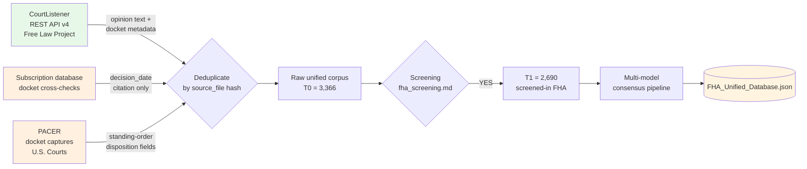

# Data Provenance

This document records where every dataset in this archive came from, when it was retrieved, under what query or authority, what was excluded, and under what redistribution terms the underlying records may be copied or linked from this repository.

## 1. Primary sources underlying the Note's doctrinal argument

All primary-source materials cited in the Note are publicly available and do not require redistribution from this archive. The archive preserves the exact query strings and retrieval dates so a reader can reproduce each citation.

### 1.1 Federal Register

- **2022 60-day notice**: 87 Fed. Reg. 58,524 (Sept. 27, 2022) (FR Doc. 2022-20868); reginfo objectID 128314001. Retrieved from reginfo.gov on 2025-09-14 and re-verified 2026-04-18; PDF preserved at [`../record/hud-27061/87FR58524_proposal.pdf`](../record/hud-27061/87FR58524_proposal.pdf) (mirror at [`../record/hud-27061/FRN60_2023.pdf`](../record/hud-27061/FRN60_2023.pdf); text extraction at [`../record/hud-27061/FRN60_2023.txt`](../record/hud-27061/FRN60_2023.txt)).
- **2023 30-day notice**: 88 Fed. Reg. 5,370 (Jan. 27, 2023) (FR Doc. 2023-01699); reginfo objectID 128443301. Retrieved from reginfo.gov on 2025-09-14 and re-verified 2026-04-18; PDF preserved at [`../record/hud-27061/88FR5370_30day_notice.pdf`](../record/hud-27061/88FR5370_30day_notice.pdf) (mirror at [`../record/hud-27061/FRN30_2023.pdf`](../record/hud-27061/FRN30_2023.pdf); text extraction at [`../record/hud-27061/FRN30_2023.txt`](../record/hud-27061/FRN30_2023.txt)).
- **NSPIRE final rule**: 88 Fed. Reg. 30,442 (May 11, 2023) (FR Doc. 2023-09693). Retrieved from https://www.govinfo.gov/content/pkg/FR-2023-05-11/pdf/2023-09693.pdf; PDF preserved at [`../record/hud-27061/88FR30442_nspire_final.pdf`](../record/hud-27061/88FR30442_nspire_final.pdf).
- **AFFH interim final rule**: 90 Fed. Reg. 11,020 (Mar. 3, 2025) (FR Doc. 2025-03360). Retrieved from https://www.govinfo.gov/content/pkg/FR-2025-03-03/pdf/2025-03360.pdf; PDF preserved at [`../record/hud-27061/90FR11020_affh_ifr.pdf`](../record/hud-27061/90FR11020_affh_ifr.pdf).
- **Disparate-impact proposed rescission**: 91 Fed. Reg. 1,475 (Jan. 14, 2026) (FR Doc. 2026-00590). Retrieved from https://www.govinfo.gov/content/pkg/FR-2026-01-14/pdf/2026-00590.pdf; PDF preserved at [`../record/hud-27061/91FR1475_disparate_impact_nprm.pdf`](../record/hud-27061/91FR1475_disparate_impact_nprm.pdf).
- **1989 Part 121 promulgation**: 54 Fed. Reg. 3,232 (Jan. 23, 1989) (Docket No. R-89-1425; FR-2565), part of HUD's Implementation of the Fair Housing Amendments Act of 1988 final rule. Retrieved from https://www.govinfo.gov/content/pkg/FR-1989-01-23/pdf/FR-1989-01-23.pdf; the PDF preserved at [`../record/hud-27061/54FR3232_part_121_promulgation.pdf`](../record/hud-27061/54FR3232_part_121_promulgation.pdf) is an 11-page extract (PDF indices 229-239) of the relevant Part 121 promulgation pages from the 408-page whole-day Federal Register issue. The full whole-day issue (113 MB) is not committed; readers can retrieve it from the URL above.

### 1.2 OMB / reginfo.gov ICR records

- **OMB Control No. 2535-0113 (Form HUD-27061) ICR history**: reginfo.gov ICR History Cycle 202301-2535-001. Harvested 2025-09-14 and re-verified 2026-04-15. The supporting documents preserved in this archive are:
  - **Supporting Statement A** for the June 13, 2023 approval at [`../record/hud-27061/2535-0113_supporting_statement_A.docx`](../record/hud-27061/2535-0113_supporting_statement_A.docx) (a duplicate copy is at [`../record/hud-27061/SSA_2023.docx`](../record/hud-27061/SSA_2023.docx); text extraction at [`../record/hud-27061/SSA_2023.txt`](../record/hud-27061/SSA_2023.txt)).
  - **OIRA conclusion / Notice of Action content** is preserved as the structured summary in [`../record/hud-27061/icr_202301-2535-001.html`](../record/hud-27061/icr_202301-2535-001.html) and the document-list landing page in [`../record/hud-27061/doc_202301-2535-001.html`](../record/hud-27061/doc_202301-2535-001.html). These pages contain the OIRA Conclusion Action ("Approved with change," 06/13/2023), Terms of Clearance, burden tables, and the full ICR docket. The standalone Notice-of-Action PDF download from reginfo.gov is gated behind a JavaScript dispatcher (`openNOA(460548)`) that does not yield a stable direct download URL; readers can retrieve it interactively from the ICR summary page at https://www.reginfo.gov/public/do/PRAViewICR?ref_nbr=202301-2535-001.
  - **Historical Supporting Statements** for the prior nine ICR cycles (2003 through 2019) are preserved as `record/hud-27061/SSA_2006.doc`, `SSA_2014.docx`, `SSA_2019.docx`, plus their `.txt` extractions. Per-cycle reginfo.gov landing pages are preserved at `record/hud-27061/icr_<YYYYMM>-2535-001.html` and `doc_<YYYYMM>-2535-001.html` for cycles 200302 through 202301.
  - **Public comment letters** received during the 2022 60-day period are preserved at `record/hud-27061/comment_SAGE.pdf` (Jones Day on behalf of SAGE) and `record/hud-27061/comment_Williams1.pdf` / `comment_Williams2.pdf` (Williams Institute / UCLA Vasquez submission, byte-identical duplicates cataloged under separate OIRA object IDs).
  - The **manifest** for these harvested artifacts (with SHA-256 hashes and source URLs) is at [`../record/hud-27061/file_inventory.csv`](../record/hud-27061/file_inventory.csv). Methodology memos at `record/hud-27061/CHRONOLOGY.md` and `record/hud-27061/RECORD_METHOD.md` (the working memorandum is retained privately).
- **OMB Control No. 2577-0083 (Form HUD-50058) field-level instructions**: Form HUD-50058 itself (which the OMB ICR governs) preserved at [`../record/hud-27061/2577-0083_form_50058_fields.pdf`](../record/hud-27061/2577-0083_form_50058_fields.pdf) (the current OCHCO-published form; lines 5e–5g cover requested-and-received accessibility-feature fields for Public Housing).

### 1.3 HUD publications

- **Form HUD-27061 (current)**: https://www.hud.gov/sites/dfiles/OCHCO/documents/27061.pdf. Retrieved 2025-09-14. PDF at [`../record/hud-27061/form_HUD-27061_current.pdf`](../record/hud-27061/form_HUD-27061_current.pdf).
- **PIH Notice 2022-03 (HA)**: https://www.hud.gov/sites/dfiles/OCHCO/documents/2022-03pihn.pdf. Retrieved 2025-11-21. PDF at [`../record/hud-27061/PIH_2022_03.pdf`](../record/hud-27061/PIH_2022_03.pdf).
- **AFFHT0007 Data Documentation (August 2024)**: https://docs.huduser.gov/archives/sites/default/files/datasets/affh/AFFH-T-Data-Documentation-AFFHT0007-August-2024.pdf. Retrieved 2025-12-04. PDF at [`../record/hud-27061/affht0007_data_documentation.pdf`](../record/hud-27061/affht0007_data_documentation.pdf).
- **AFFH-T User Guide (v4.0 Final, 2017)**: https://www.hud.gov/sites/dfiles/FHEO/documents/AFFHT_4_0_User_Guide_Final_2017.pdf. The HUD URL serves a redirect chain that resists automated retrieval; readers can fetch interactively. The repository does not currently include the User Guide PDF; the AFFH-T data documentation (AFFHT0007) above contains the load-bearing dataset definitions cited by the Note.
- **HUD OIG Audit Report 2022-BO-0001 ("HUD Did Not Have Sufficient Information on Federally Funded Accessible Housing")**: hudoig.gov. Retrieved 2025-12-04. PDF at [`../record/hud-27061/HUD_OIG_2022-BO-0001.pdf`](../record/hud-27061/HUD_OIG_2022-BO-0001.pdf).

### 1.4 GAO

- **GAO-23-105083 ("Rental Housing: Information on HUD's Inspection Process and Initiatives to Improve Rental Housing Conditions")**: gao.gov. Retrieved 2025-11-21. PDF at [`../record/hud-27061/GAO_23_105083.pdf`](../record/hud-27061/GAO_23_105083.pdf).

### 1.5 Census / ACS / HUD data products

- **American Community Survey 5-Year 2023 Tables B25034 and B25036**: data.census.gov. Retrieved 2026-01-22 via Census API key. Within-decade stock-adjustment derivation is documented inline in the Note (Part I.B and footnotes); the standalone `results/acs_pre_1991_stock_audit.md` memo is *not committed* — readers can reproduce the adjustment from the ACS tables and the Note's reported coefficients.
- **HUD Picture of Subsidized Households (POSH) 2024Q4**: huduser.gov. Retrieved 2026-02-01. The full POSH release (`data/posh_2024q4_assisted_stock.csv`) is *not committed* due to size; readers can re-download from https://www.huduser.gov/portal/datasets/assthsg.html (POSH 2024 Q4 release).
- **LIHTCPUB 2023 release**: lihtc.huduser.gov. Retrieved 2026-02-08. The full LIHTCPUB release (`data/lihtcpub_2023.csv`) is *not committed* due to size; readers can re-download from https://lihtc.huduser.gov/.
- **AHS 2011 accessibility analysis (Bo'sher et al., HUD PD&R 2015)**: https://www.huduser.gov/portal/sites/default/files/pdf/accessibility-america-housingStock.pdf. Retrieved 2026-02-08. PDF at [`../record/hud-27061/Boshers_AHS_2011_accessibility.pdf`](../record/hud-27061/Boshers_AHS_2011_accessibility.pdf).

### 1.6 State Qualified Allocation Plans

- **QAP 2025-2026 audit (50 states + DC; 51 jurisdictions — Puerto Rico is NOT in scope)**: Each QAP retrieved directly from the state housing finance agency between 2025-12-10 and 2026-02-28. The QAP synthesis memorandum is retained in the project's private research records. Per-jurisdiction provenance IS committed: [`../results/qap_jurisdiction_ledger.csv`](../results/qap_jurisdiction_ledger.csv) carries each jurisdiction's disposition (41 classified / 7 manual-review / 3 retrieval-error), selected document URL, title/year, classification, and status notes, generated from [`../results/qap_accessibility_2025_2026.json`](../results/qap_accessibility_2025_2026.json) by `scripts/make_qap_ledger.py`. The scan is a link-selection and keyword-heuristic screen, not a final human-adjudicated state coding; unresolved rows are reported as unresolved, never as negative findings.

### 1.7 Federal-opinion-database citation audits

The Note's three federal-opinion-database audits — the Part 121 citation sweep, the comparator counts for § 100.200 and § 3614a, and the DOJ § 3604(f)(3) sweep — were conducted by the author on a subscription federal-opinion database under a university library seat. Queries were logged:

- **Part 121 sweep**: query string `"24 C.F.R. Part 121"` run 2026-04-03; results at `replication/queries/part_121.query.txt` and `hud_administrative_record_deep_dives.md` (retained in the project's private research records) § 8.
- **§ 100.200 comparator**: query string `"24 C.F.R. § 100.200"` run 2026-04-03; `replication/queries/100_200_comparator.query.txt`.
- **§ 3614a comparator**: query string `"42 U.S.C. § 3614a"` run 2026-04-03; `replication/queries/3614a_comparator.query.txt` and `doctrinal_case_audits.md` (retained in the project's private research records) § 1.
- **DOJ § 3604(f)(3) sweep**: query `PA("United States") AND "3604(f)(3)"` filtered to pattern-or-practice and complaint-referral matters; run 2026-04-04; the query is committed at `replication/queries/doj_3604f3.query.txt`. The sweep memo itself is retained in the author's working archive and is NOT committed (it derives from a subscription database whose terms bar redistribution of result content); the Note-cited conclusions rest on the logged query and the primary filings it surfaced.

The subscription database's terms of service prohibit redistribution of opinion text pulled through the seat. The archive therefore preserves the query strings and coded result lists (case citations, classification judgments, audit dates) but not the full opinion texts; the underlying opinions are freely accessible through CourtListener, PACER, or other public services at the citations reported.

## 2. FHA Unified Database

*Text equivalent of the diagram: three sources feed a deduplication step keyed on the
`source_file` hash -- the CourtListener REST API v4 (Free Law Project), contributing
opinion text and docket metadata; a subscription database, contributing decision_date and
citation only; and PACER docket captures (U.S. Courts), contributing standing-order
disposition fields. Deduplication yields the raw unified corpus, T0 = 3,366. Screening
under `fha_screening.md` passes records marked YES through to T1 = 2,690 screened-in FHA.
T1 enters the multi-model consensus pipeline, which writes `FHA_Unified_Database.json`.*

> [!WARNING]
> Subscription-database terms of service prohibit redistribution of opinion text pulled through the seat. This archive distributes only fields that are factual and public (decision_date, case_name, citation). PACER PDFs and full opinion texts are not redistributed. The 853 CourtListener texts used for validation and comparator work are on file with the author; [`../opinion_sources.csv`](../opinion_sources.csv) preserves their provenance and normalized hashes.

### 2.1 Retrieval

The unified FHA database in `data/FHA_Unified_Database.json` was assembled between 2025-06-15 and 2025-08-30 from the following sources, each of which is freely redistributable under its own licensing terms:

- **CourtListener opinions and docket metadata** (Free Law Project): pulled via the CourtListener REST API (courtlistener.com/api/rest/v4/) using the authenticated-user token held by the author. Opinions were selected by Boolean query on case name, statutory cite, and docket type restricted to federal district, circuit, bankruptcy, and specialized courts. Pull completed 2025-08-09. CourtListener opinions are released under the Free Law Project Terms of Use, which permit redistribution with attribution. Full opinion text is not distributed in this repository. The 853 texts consumed by the validation and comparator modules are on file with the author. The canonical JSON itself carries no full-text field; [`../opinion_sources.csv`](../opinion_sources.csv) maps every database row to its CourtListener cluster id and stable URL, and preserves normalized-text SHA-256 hashes for the on-file texts. [`../scripts/fetch_opinion_texts.py`](../scripts/fetch_opinion_texts.py) documents the deterministic fetch-normalize-hash route.
- **Subscription-database docket-metadata cross-checks**: used only to cross-validate CourtListener citations and extract decision dates where CourtListener returned null. Subscription-database TOS prohibit redistribution of opinion text; the archive redistributes only the fields (decision_date, case_name, citation) that are factual and public.
- **PACER docket captures** (U.S. Courts): used only for standing-order and disposition fields where both CourtListener and the subscription database returned null. Pull completed 2025-08-22. PACER captures are released under the U.S. Courts' Privacy Policy for electronic court records; the archive redistributes only the text fields reported in docket entries, not the filed PDFs.

### 2.2 Screening and classification

- **Screening queries**: every record in the raw pull was passed through the screening prompt at [`../method/prompts/fha_screening_prompt.txt`](../method/prompts/fha_screening_prompt.txt), which asks a base classifier to decide whether the opinion substantively pleads or adjudicates a federal Fair Housing Act or § 504 / Rehabilitation Act claim.
- **Classification**: screened-in records were classified along several axes (protected class membership, disability allegation flag, rehabilitation-act-case flag, outcome direction, pleading-loss flag, pleading-failure family and mechanism, pro se status, institutional-plaintiff status, decision date, period assignment) using the multi-model consensus pipeline documented in [`../method/VALIDATION.md`](../method/VALIDATION.md). The classification prompt itself is in [`../method/prompts/case_classification_prompt.txt`](../method/prompts/case_classification_prompt.txt); consensus-resolution rules, field-normalization rules, and the per-claim extraction schema are in [`../method/pipeline/`](../method/pipeline/).

### 2.3 Cutoffs

- **Retrieval cutoff**: the original assembly retrieved docket entries through 2025-08-30; a March 2026 refresh extended coverage through 2026-03-25; and a July 3, 2026 CourtListener re-pull (original query, all precedential statuses including Unknown, full window January 1, 2022 through July 1, 2026) added 168 screened-in records against the existing corpus, carried under two source tags: 133 records tagged `p3ext_20260703` and 35 records tagged `p3ext_20260703_r2`. The initial deduplication of the 180-record pull was by case name, which incorrectly dropped 35 distinct later opinions in cases already present in the corpus; a cluster-ID audit re-deduplicated on CourtListener cluster ID and restored those 35 records, which carry the `_r2` tag. The canonical database is therefore 3,366 records (3,198 pre-extension + 168 screened-in). The refresh increment is CourtListener-only — no subscription-database cross-checks, PACER fills, or Google Scholar supplement were run for it. The Note's three-period framework treats 2026-07-01 (maximum `date_filed`) as the right-hand boundary of P3 for the canonical snapshot.
- **Decision-date floor**: the disability-wave analyses use `date_filed >= 2022-01-01`, where `date_filed` is the CourtListener OpinionCluster filing date — equivalent to the opinion's decision date for the purposes of this dataset. Pre-2022 records are retained in T2 (canonical) and T4 (pleading-loss universe) so that baseline and wave comparisons can be computed without refetching. (The terminology "decision date" in the Note's prose and "date_filed" in the JSON / SAMPLE_DEFINITIONS / scripts refer to the same field; see [`../data/dictionaries/fha_unified_database.md`](../data/dictionaries/fha_unified_database.md) § Case Identification.)
- **Decision-date requirement**: analyses that compare periods require a non-null `date_filed` falling within the study window and a decisive outcome. The dated-decided T2 subset is n = 995 (1,900 − 553 lacking `date_filed` − 352 with non-decisive outcomes). See [`SAMPLE_DEFINITIONS.md`](SAMPLE_DEFINITIONS.md) § 3.

### 2.4 Exclusions

- Opinions with `screening_result == "NO"` — excluded from T1 downward.
- Opinions with a missing `case_name` — excluded as retrieval-layer parsing failures.
- Duplicate opinions across CourtListener and PACER — deduplicated on `source_file` hash after normalization.

No opinion was excluded on the basis of outcome direction, jurisdiction, circuit, classifier-assigned claim type, or representation status.

### 2.5 Redistribution and minimization

The `data/FHA_Unified_Database.json` file in this archive redistributes:

- Factual docket metadata (case name, decision date, citation, court, filing date) from subscription opinion databases and PACER (factual public records; not copyrightable).
- Classifier-assigned labels produced by the multi-model consensus pipeline (original to this project; released under the archive's chosen data license, see [`../LICENSE-DATA`](../LICENSE-DATA)).

The published databases are minimized projections of the full research databases: five
free-text and property-level fields (model-written case summaries and holdings, the
accommodation narrative, free-text race detail, and property city) are removed by
[`../scripts/minimize_public_dataset.py`](../scripts/minimize_public_dataset.py), which
records the registered digest of each full source. No published claim reads a removed
field — the release gate re-derives the registered baselines from the minimized file on
every run — and the full databases are retained in the project's private research
records. Court records are public, but a compiled corpus of disability-related
narratives raises a data-minimization question of its own; the archive publishes the
fields the published analyses need, and no more.

The canonical JSON contains NO opinion-text field. Full opinion text is not redistributed in this
repository. The 853 CourtListener texts consumed by the validation and comparator modules are on file
with the author. [`../opinion_sources.csv`](../opinion_sources.csv) maps all 3,366 database rows to
CourtListener cluster ids and stable URLs where available, and preserves normalized-text hashes for
the on-file texts; [`../scripts/fetch_opinion_texts.py`](../scripts/fetch_opinion_texts.py) documents the
deterministic retrieval route. Opinion text from subscription opinion databases and PDF docket filings
from PACER are also NOT redistributed.

## 3. Prompt and pipeline artifacts

- **Classification prompts**: `method/prompts/*.md`. Prompts were frozen at the cutoff and not modified between runs.
- **Base classifiers**: MiniMax M2.7, DeepSeek V3.2, and Kimi K2.5 were accessed through the OpenRouter API between 2025-06-18 and 2025-08-28. Model slugs and API-retrieval dates are logged at `method/pipeline/model_metadata.json`.
- **Adjudication classifiers**: Anthropic Haiku 4.5 and Sonnet 4.6 were accessed through the Anthropic API during the same window. API dates and message-format records at `method/pipeline/adjudication_metadata.json`.
- **Independent audit classifier**: Anthropic Opus 4.6 was accessed via the Anthropic API on 2026-01-08–2026-01-10 for the stratified 50-opinion independent re-classification reported in [`../method/VALIDATION.md`](../method/VALIDATION.md).

## 4. Supporting data releases not reproduced here

Several datasets the Note cites in passing are large public releases that are not re-distributed in this archive to avoid duplicating data already maintained elsewhere:

- **HMDA LAR / MLAR public releases**: cited for regulator-public bifurcation architecture (Part IV § C). Accessed through ffiec.cfpb.gov; not mirrored here.
- **CRDC biennial releases**: cited as peer-system existence proof (Part II.D). Accessed through ocrdata.ed.gov; not mirrored here.
- **Census Title 13 small-cell-suppression guidance**: cited as privacy-design comparator (Part IV § C). Accessed through census.gov; not mirrored here.
- **NDIS Specialist Disability Accommodation releases** (Australia): cited as peer-jurisdiction existence proof (Part II.D, Part IV § D). Accessed through dataresearch.ndis.gov.au; not mirrored here.

## 5. Contact

Questions about retrieval, query strings, or redistribution scope: Nicholas Gill — nickgill@arizona.edu.

## Privately retained material

This archive is the publication layer of a larger research record. The following classes
of material are retained in the project's private research records rather than published
here, and every in-archive pointer to "the project's private research records" refers to
this section:

- **Working logs and as-run execution records** (run logs, session records, development
  queues, and the as-run editions of research memoranda). The published record preserves
  their registered hashes where a hash was registered (see
  `../method/preregistration/README.md` and `HASH_MANIFEST.json`), so any privately
  retained instrument can be verified byte-exact on request.
- **Exploratory research memoranda and research leads** (including the former
  `results/supporting/` analysis layer and the `supplementary/` index). These are
  LLM-assisted working analyses that are not part of the Note's claim path; nothing the
  Note prints relies on them. Their negative and superseded results are summarized in
  [`../article/EVIDENCE_AND_LIMITS.md`](../article/EVIDENCE_AND_LIMITS.md).
- **Unredacted intermediates** (raw scrapes, pre-redaction case texts, and
  development-era working files), retained under the same source-discipline rules the
  published data dictionary describes.
- **Litigation-development analyses** (prospective-plaintiff assessments and draft
  judicial-review materials). No litigation template is published: any complaint would
  need to respond to an actual agency disposition, an identified plaintiff, the governing
  venue, and the resulting administrative record, none of which presently exists.

Requests to inspect privately retained material for verification purposes can be made
through the contact routes in the README.
